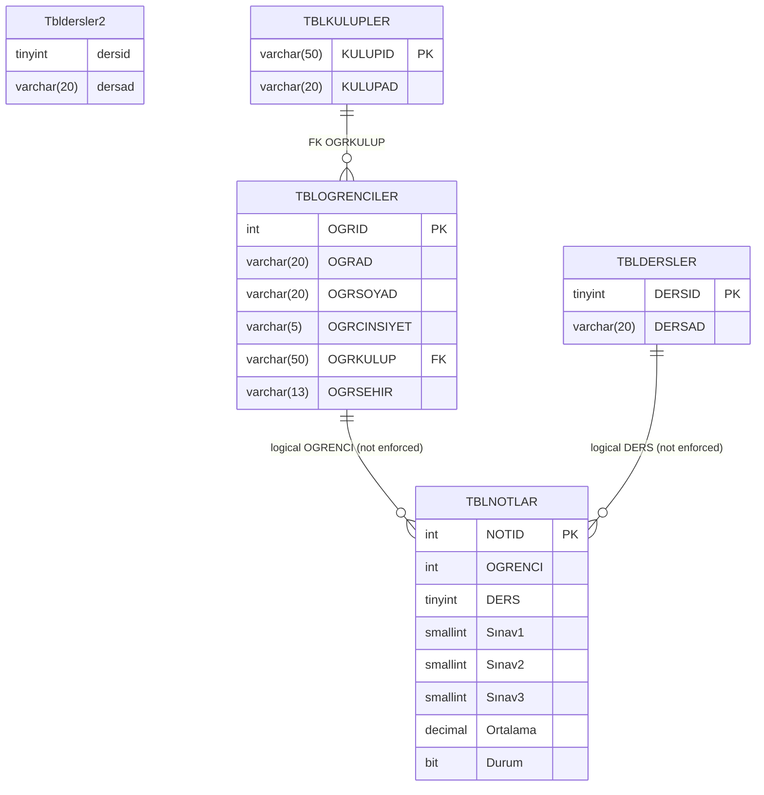

# Veri Sozlugu ve Diyagram (DbOgrenciNot)

Bu dokuman, kullanicinin paylastigi SQL scriptine gore olusturulmustur.
Tablo ve kolon adlari bire bir korunmustur. `Sınav1/2/3` kolonlari Unicode
karakter (dotless i) icerdigi icin oldugu gibi yazilmistir.

## Tablolar

### TBLDERSLER
| Kolon | Tip | Null | Anahtar | Aciklama |
| --- | --- | --- | --- | --- |
| DERSID | tinyint | NOT NULL | PK | Ders kimligi |
| DERSAD | varchar(20) | NULL |  | Ders adi |

### Tbldersler2
| Kolon | Tip | Null | Anahtar | Aciklama |
| --- | --- | --- | --- | --- |
| dersid | tinyint | NULL |  | Ders kimligi (PK yok) |
| dersad | varchar(20) | NULL |  | Ders adi |

### TBLKULUPLER
| Kolon | Tip | Null | Anahtar | Aciklama |
| --- | --- | --- | --- | --- |
| KULUPID | varchar(50) | NOT NULL | PK | Kulup kimligi |
| KULUPAD | varchar(20) | NULL |  | Kulup adi |

### TBLOGRENCILER
| Kolon | Tip | Null | Anahtar | Aciklama |
| --- | --- | --- | --- | --- |
| OGRID | int | NOT NULL | PK | Ogrenci kimligi |
| OGRAD | varchar(20) | NULL |  | Ogrenci adi |
| OGRSOYAD | varchar(20) | NULL |  | Ogrenci soyadi |
| OGRCINSIYET | varchar(5) | NULL |  | Ogrenci cinsiyet |
| OGRKULUP | varchar(50) | NULL | FK | TBLKULUPLER.KULUPID |
| OGRSEHIR | varchar(13) | NULL |  | Ogrenci sehir |

### TBLNOTLAR
| Kolon | Tip | Null | Anahtar | Aciklama |
| --- | --- | --- | --- | --- |
| NOTID | int IDENTITY(1,1) | NOT NULL | PK | Otomatik artan not kimligi |
| OGRENCI | int | NULL |  | Ogrenci kimligi (FK yok) |
| DERS | tinyint | NULL |  | Ders kimligi (FK yok) |
| Sınav1 | smallint | NULL |  | 1. sinav notu |
| Sınav2 | smallint | NULL |  | 2. sinav notu |
| Sınav3 | smallint | NULL |  | 3. sinav notu |
| Ortalama | decimal(5,0) | NULL |  | Sinav ortalamasi |
| Durum | bit | NULL |  | Gecti/Kaldi durumu |

## Kisitlar (Constraints)

**Primary Keys**
- PK_TBLDERSLER: TBLDERSLER.DERSID
- PK_TBLKULUPLER_1: TBLKULUPLER.KULUPID
- PK_TBLNOTLAR: TBLNOTLAR.NOTID
- PK_TBLOGRENCILER: TBLOGRENCILER.OGRID

**Foreign Keys**
- FK_TBLOGRENCILER_TBLKULUPLER: TBLOGRENCILER.OGRKULUP -> TBLKULUPLER.KULUPID

## Iliskiler

**Zorunlu (FK ile)**
- TBLKULUPLER (1) -> (N) TBLOGRENCILER

**Mantiksal (scriptte FK yok)**
- TBLOGRENCILER (1) -> (N) TBLNOTLAR, OGRENCI kolonu
- TBLDERSLER (1) -> (N) TBLNOTLAR, DERS kolonu

## ER Diyagram (Mermaid)

