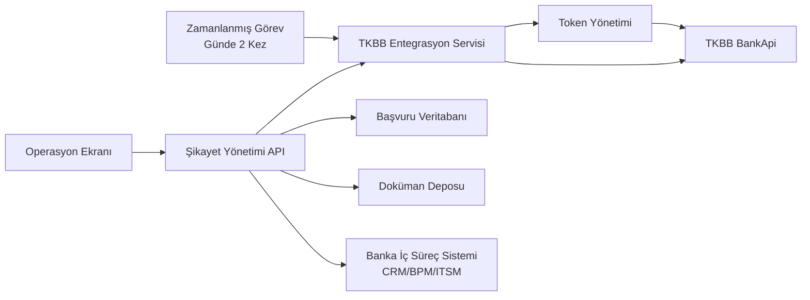
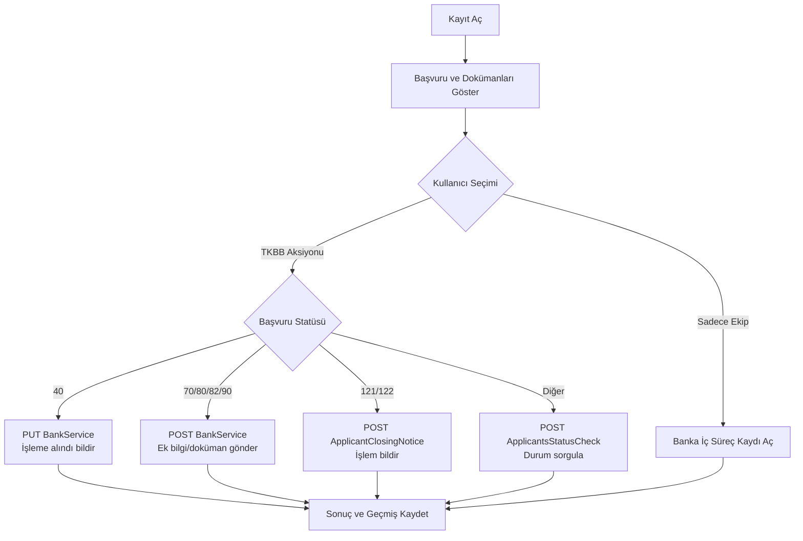

# TKBB Hakem Heyeti Başvuru Sistemi Entegrasyonu Analiz ve Mimari Dokümanı

## 1. Amaç ve Kapsam

Bu doküman, TKBB Hakem Heyeti Başvuru Sistemi REST servisleri baz alınarak bankanın şikayet/başvuru takip ekranı ve entegrasyon mimarisini tanımlar.

Hedeflenen yapı:

- Günde iki kez çalışan zamanlanmış görev ile TKBB tarafından bankaya iletilen tüm başvuruları almak.
- Başvuruları tek bir ekranda statü, deadline, konu, ad soyad ve TCKN bilgileriyle listelemek.
- Her satırda `Kayıt Aç` ve `Detay` aksiyonlarını sunmak.
- `Kayıt Aç` akışında başvuru verilerini ve varsa dokümanları listelemek.
- Başvuru Durum Kodlarına göre TKBB API çağrılarını tetiklemek.
- TKBB statüsü seçilmez, ancak banka içi ekip seçilirse başvuruyu banka iç süreçlerine yönlendirmek.
- Operasyon ekiplerinin izleyebileceği temel ekran tasarımını oluşturmak.

## 2. Varsayımlar

- TKBB servislerine erişim için banka adına kullanıcı adı, parola ve IP tanımı yapılmış olacaktır.
- Token geçerlilik süresi dolmadan önce servis çağrılarında mevcut token kullanılacak; süresi dolmuşsa yeniden token alınacaktır.
- Listeleme ekranında TCKN maskeleme yetki bazlı uygulanacaktır. Operasyon kullanıcısı kısıtlı TCKN, yetkili kullanıcı tam TCKN görebilir.
- TKBB dokümanları 10 MB altındaysa liste servisinde base64 olarak gelir; 10 MB üstü dosyalar için ayrıca dosya indirme servisi çağrılır.
- Banka içi kayıt açma CRM, BPM, ITSM veya şikayet yönetimi ürünü gibi mevcut bir sistemde olabilir. Bu dokümanda bu katman `Banka İç Süreç Sistemi` olarak genelleştirilmiştir.
- Canlı ortam URL'leri test URL'lerinden farklı olabilir; ortam bazlı konfigürasyon kullanılmalıdır.

## 3. Üst Seviye Mimari



### 3.1 Bileşenler

| Bileşen | Sorumluluk |
| --- | --- |
| Zamanlanmış Görev | Günde iki kez TKBB başvuru listesini çeker, statü kontrolü yapar ve lokal kayıtları günceller. |
| TKBB Entegrasyon Servisi | Token alma, başvuru sorgulama, doküman sorgulama, statü bazlı bildirim ve dosya indirme çağrılarını yönetir. |
| Şikayet Yönetimi API | UI için liste, detay, kayıt açma, ekip yönlendirme ve aksiyon servislerini sağlar. |
| Başvuru Veritabanı | TKBB başvuru metadatası, statü, deadline, senkronizasyon durumu ve iç süreç ilişki bilgilerini saklar. |
| Doküman Deposu | TKBB'den alınan veya bankadan gönderilecek dosyaları saklar. |
| Operasyon Ekranı | Başvuru listesi, detay görüntüleme, kayıt açma ve aksiyon seçimlerini sağlar. |
| Banka İç Süreç Sistemi | TKBB dışında ilerleyecek banka içi ekip atama ve iş akışı süreçlerini yönetir. |

## 4. TKBB Servis Envanteri

| İşlev | Metot | Endpoint | Kullanım |
| --- | --- | --- | --- |
| Banka kullanıcı doğrulama | POST | `/BankApi/LoginBank` | Token ve geçerlilik süresi alınır. |
| Banka başvuru sorgulama | GET | `/BankApi/BankService` | Yeni/aksiyon bekleyen başvurular alınır. |
| Sayfalı başvuru sorgulama | POST | `/BankApi/BankService/GetApplicantPaginatedList` | Belirli sayıda başvuru alınır. Büyük listeler için önerilir. |
| Başvuru işleme alındı | PUT | `/BankApi/BankService` | 40 statüsündeki başvurular için bankanın işleme aldığı bildirilir. |
| Başvuru bilgi güncelleme | POST | `/BankApi/BankService` | Mesaj ve banka dokümanları form-data ile gönderilir. |
| Başvuru durum sorgulama | POST | `/BankApi/BankService/ApplicantsStatusCheck` | Lokal kayıtların güncel TKBB statüsü kontrol edilir. |
| Başvuru dosyaları sorgulama | POST | `/BankApi/BankService/GetApplicantDocuments` | Başvuruya ait doküman listesi alınır. |
| Dosya sorgulama | POST | `/BankApi/BankService/GetApplicantDocumentFile` | Dosya id ile büyük dosya içeriği alınır. |
| Dosya kategorileri sorgulama | GET | `/BankApi/BankService/GetDocumentsTypesList` | Doküman tipleri ve kategorileri alınır. |
| Banka aleyhine karar işlem bildirimi | POST | `/BankApi/BankService/ApplicantClosingNotice` | 121 statüsündeki başvurularda bankanın işlemi tamamladığı bildirilir. |

## 5. Zamanlanmış Görev Tasarımı

### 5.1 Çalışma Periyodu

Görev günde iki kez çalıştırılır. Önerilen yapı:

- Sabah çalışması: operasyon günü başlamadan önce yeni başvuruları ve deadline yaklaşan işleri almak.
- Öğleden sonra çalışması: gün içinde TKBB tarafından eklenen/güncellenen başvuruları almak.

Cron örneği:

```text
0 8,14 * * *
```

Saat bilgisi bankanın operasyon saatlerine göre konfigüre edilmelidir.

### 5.2 Görev Akışı

1. Geçerli token var mı kontrol edilir.
2. Token yoksa veya süresi dolmuşsa `LoginBank` çağrılır.
3. `GetApplicantPaginatedList` veya `BankService` ile TKBB'nin bankaya ilettiği başvurular alınır.
4. Gelen her başvuru için `applicantNumber` üzerinden idempotent upsert yapılır.
5. Yeni veya aksiyon bekleyen başvurular için doküman listesi `GetApplicantDocuments` ile alınır.
6. 10 MB üstü olduğu için `file = null` dönen dokümanlarda `GetApplicantDocumentFile` çağrısı ile dosya indirilir.
7. Lokal kaydı olan aktif başvurular için `ApplicantsStatusCheck` ile güncel statü alınır.
8. Başvuru statüsü, deadline ve doküman ihtiyacı güncellenir.
9. Hata alan kayıtlar retry kuyruğuna alınır ve operasyon ekranında senkronizasyon uyarısı gösterilir.

### 5.3 İdempotency ve Tekrarlı Kayıt Önleme

- Anahtar alan: `applicantNumber`
- İkincil referans: `applicantNo`
- Aynı başvuru tekrar geldiğinde yeni kayıt açılmaz; mevcut kayıt güncellenir.
- Dokümanlar için anahtar alan: `documentId`
- Kayıt açma aksiyonunda banka iç süreç sisteminden dönen `internalCaseId` saklanır. Aynı başvuru için ikinci kez kayıt açılması engellenir veya kullanıcıya mevcut kayıt gösterilir.

## 6. Veri Modeli Önerisi

### 6.1 tkbb_applications

| Alan | Tip | Açıklama |
| --- | --- | --- |
| id | UUID/Long | Lokal kayıt anahtarı |
| applicant_number | Integer | TKBB başvuru numarası |
| applicant_no | String | TKBB başvuru no |
| first_name | String | Başvuru sahibi adı |
| last_name | String | Başvuru sahibi soyadı |
| tckn | String | TCKN, şifreli veya maskelenmiş saklanmalı |
| topic_id | Integer | Başvuru konusu id |
| topic_name | String | Başvuru konusu |
| request_text | Text | Başvuru talep açıklaması |
| applicant_status | Integer | TKBB başvuru durum kodu |
| applicant_status_text | String | Durum açıklaması |
| decision_topic | String | Karar tipi |
| bank_response_end_date | Datetime | Bankanın son cevap tarihi |
| message | Text | TKBB mesajı / ek açıklama |
| internal_case_id | String | Banka iç süreç kayıt numarası |
| internal_team_code | String | Banka iç ekip |
| internal_process_status | String | Banka iç süreç statüsü |
| sync_status | String | SUCCESS, WARNING, FAILED |
| last_synced_at | Datetime | Son TKBB senkronizasyon zamanı |
| created_at | Datetime | Oluşturma zamanı |
| updated_at | Datetime | Güncelleme zamanı |

### 6.2 tkbb_documents

| Alan | Tip | Açıklama |
| --- | --- | --- |
| id | UUID/Long | Lokal doküman anahtarı |
| application_id | UUID/Long | Başvuru ilişkisi |
| tkbb_document_id | Integer | TKBB belge id |
| name | String | Belge adı |
| mime_type | String | MIME tipi |
| document_topic_id | Integer | Belge tipi id |
| document_topic_name | String | Belge tipi adı |
| applicant_document_code | String | Dosya tipi |
| storage_path | String | Lokal obje/dosya deposu referansı |
| source | String | CITIZEN, TKBB, BANK |
| is_large_file | Boolean | 10 MB üstü dosya işareti |
| created_at | Datetime | Oluşturma zamanı |

### 6.3 tkbb_action_history

| Alan | Tip | Açıklama |
| --- | --- | --- |
| id | UUID/Long | Aksiyon anahtarı |
| application_id | UUID/Long | Başvuru ilişkisi |
| action_type | String | FETCHED, ACKNOWLEDGED, INFO_SENT, INTERNAL_ROUTED, CLOSED_NOTICE |
| old_status | Integer | Önceki TKBB statüsü |
| new_status | Integer | Yeni TKBB statüsü |
| request_payload_ref | String | Güvenli log referansı |
| response_code | String | HTTP/resultCode |
| response_message | String | Servis dönüş mesajı |
| performed_by | String | Kullanıcı veya sistem |
| performed_at | Datetime | Aksiyon zamanı |

## 7. Başvuru Durum Kodlarına Göre İş Kuralları

| Kod | Durum | Önerilen UI Aksiyonu | TKBB API Aksiyonu |
| --- | --- | --- | --- |
| 40 | Başvuru Banka Gönderim Listesinde | `Kayıt Aç` aktif, ilk işleme alma önerilir | `PUT /BankService` ile işleme alındı bildirimi |
| 50 | Başvuru Bankaya Gönderildi | `Kayıt Aç` aktif | Başvuru listeye alınır, gerekirse detay/doküman çekilir |
| 60 | Banka tarafından işleme alındı | Detay ve iç ekip takibi | Statü kontrolü yapılır |
| 70 | Başvuru İncelemede | Bilgi/doküman gönderimi yapılabilir | `POST /BankService` form-data ile bilgi güncelleme |
| 80 | Banka ek bilgi gönderim listesinde | Ek bilgi yanıtı ve doküman yükleme aktif | `POST /BankService` form-data |
| 82 | Ara karar verilen başvuru | Ara karar gereği aksiyon ve doküman yükleme aktif | `POST /BankService` form-data |
| 85 | Ek bilgiye istinaden banka tarafından işleme alındı | İç takip | Statü kontrolü |
| 90 | Banka ek bilgi gönderdi | Ek cevap gönderimi yapılabilir | `POST /BankService` form-data |
| 100 | Banka işlemine göre onay kararı verildi | İzleme | Statü kontrolü |
| 105 | Heyet gündemine alınacaklar | İzleme | Statü kontrolü |
| 110 | Heyet gündemine alındı | İzleme | Statü kontrolü |
| 118 | Karar yayınlanmayı bekliyor | İzleme | Statü kontrolü |
| 120 | Hakem Heyeti kararı verildi | Karar sonucu sorgulanır | `ApplicantsStatusCheck`; 121 veya 123'e güncellenebilir |
| 121 | Karar bankaya iletildi / banka aleyhine işlem bekleniyor | Kapanış bildirimi aktif | `ApplicantClosingNotice` |
| 122 | Banka aleyhine karar işlem bildirimi gecikmiş | Acil aksiyon ve eskalasyon | `ApplicantClosingNotice` |
| 123 | Kapanan başvuru | Salt okunur | API aksiyonu yok |

## 8. Kayıt Açma Akışı

### 8.1 Ekran Davranışı

Kullanıcı liste ekranında `Kayıt Aç` butonuna basınca:

1. Başvuru özet bilgileri gösterilir:
   - Başvuru No
   - Statü
   - Deadline
   - Konu
   - Ad soyad
   - TCKN
   - Talep açıklaması
2. Başvuruya ait dokümanlar listelenir:
   - Dosya adı
   - Doküman tipi
   - Kaynak
   - Görüntüle/indir aksiyonu
3. Kullanıcıya iki ana seçim alanı sunulur:
   - `TKBB Başvuru Aksiyonu` combobox
   - `Banka İçi Ekip` combobox
4. Kullanıcı TKBB aksiyonu seçerse statüye uygun API çağrısı hazırlanır.
5. Kullanıcı TKBB aksiyonu seçmez, sadece ekip seçerse başvuru banka iç süreç sistemine yönlendirilir.
6. Kayıt açma sonucu:
   - TKBB API sonucu
   - Banka iç kayıt numarası
   - Oluşan task/iş emri
   kullanıcıya gösterilir.

### 8.2 Combobox Önerileri

#### TKBB Başvuru Aksiyonu

| Değer | Uygun Statüler | Açıklama |
| --- | --- | --- |
| İşleme Alındı Bildir | 40 | TKBB'ye bankanın başvuruyu işleme aldığı bildirilir. |
| Ek Bilgi / Cevap Gönder | 70, 80, 82, 90 | Mesaj ve dokümanlarla TKBB'ye cevap gönderilir. |
| Durum Sorgula | Tüm aktif statüler | Başvurunun TKBB'deki güncel statüsü alınır. |
| Kapanış İşlem Bildir | 121, 122 | Banka aleyhine karar için işlemin yapıldığı bildirilir. |

#### Banka İçi Ekip

| Ekip | Kullanım |
| --- | --- |
| Şikayet Yönetimi | Genel başvuru inceleme |
| Hukuk | Ara karar, hakem heyeti kararı ve banka aleyhine kararlar |
| Operasyon | Evrak, süreç ve işlem teyidi |
| Ürün Sahibi | Ürün/grup bazlı inceleme |
| Müşteri İletişim Merkezi | Müşteri iletişimi gerektiren durumlar |
| Uyum/Risk | Mevzuat, risk ve kontrol değerlendirmesi |

## 9. Ekran Tasarımı

### 9.1 Liste Ekranı Kolonları

| Kolon | Açıklama |
| --- | --- |
| Statü | TKBB başvuru durum kodu ve açıklaması |
| Deadline | `bankResponseEndDate`; yaklaşan tarihler renkli gösterilir |
| Konu | `topicName` |
| Ad Soyad | `firstName` + `lastName` |
| TCKN | Yetkiye göre maskeli veya açık |
| Başvuru No | `applicantNo` |
| Senkronizasyon | Son TKBB senkronizasyon durumu |
| Aksiyonlar | `Kayıt Aç`, `Detay` |

### 9.2 Filtreler

- Statü
- Deadline aralığı
- Konu
- TCKN / başvuru no arama
- İç ekip
- İç süreç statüsü
- Sadece aksiyon bekleyenler

### 9.3 Detay Ekranı Bölümleri

- Başvuru bilgileri
- Kişi ve iletişim bilgileri
- Vekil bilgileri
- Talep ve açıklama
- TKBB statü geçmişi
- Dokümanlar
- Banka iç süreç kayıtları
- TKBB'ye gönderilen/gelen mesajlar
- Aksiyon geçmişi

## 10. API Karar Akışı



## 11. Güvenlik ve Denetim

- Token kullanıcı ekranına veya frontend loglarına taşınmamalıdır.
- TCKN ve kişisel veriler veritabanında şifreli, ekranda yetkiye göre maskeli gösterilmelidir.
- Dosya indirme linkleri süreli ve yetki kontrollü olmalıdır.
- Tüm TKBB çağrıları için correlation id üretilmelidir.
- Servis payload'ları kişisel veri içerdiğinden ham payload loglanmamalı; güvenli referans veya maskeleme kullanılmalıdır.
- `Kayıt Aç`, `TKBB'ye Gönder`, `Kapanış Bildir` gibi aksiyonlar kullanıcı, zaman ve sonuç bilgisiyle audit log'a yazılmalıdır.

## 12. Hata Yönetimi

| Senaryo | Önerilen Davranış |
| --- | --- |
| 401 token hatası | Token yenilenir ve çağrı bir kez tekrar edilir. |
| 400 istemci hatası | Kayıt hata durumuna alınır, kullanıcıya doğrulanabilir mesaj gösterilir. |
| 403 yetki hatası | Sistem yöneticisine alarm üretilir. |
| 404 kaynak yok | İlgili doküman/başvuru için uyarı loglanır. |
| 500 servis hatası | Retry kuyruğuna alınır. |
| resultCode 101 | Banka bilgileri kontrolü için entegrasyon alarmı üretilir. |
| resultCode 102 | Başvurunun mevcut statüsünde aksiyon yapılamadığı kullanıcıya gösterilir. |
| resultCode 103 | Başvuru cevabı başarılı kabul edilir ve geçmişe yazılır. |
| resultCode 104 | Başvuru bilgisi bulunamadı olarak işaretlenir, statü sorgulama önerilir. |

## 13. MVP Kapsamı

İlk faz için önerilen minimum kapsam:

1. Günde iki kez çalışan başvuru senkronizasyon görevi.
2. Token yönetimi.
3. Başvuru listeleme ve detay ekranı.
4. Doküman listeleme ve indirme.
5. Kayıt açma ekranı.
6. Statüye göre şu API aksiyonları:
   - 40: İşleme alındı bildirimi
   - 70/80/82/90: Ek bilgi ve doküman gönderimi
   - 121/122: Kapanış bildirimi
   - Aktif tüm statüler: Durum sorgulama
7. Banka iç ekip seçimi ile iç süreç kaydı açma.
8. Aksiyon geçmişi ve temel audit log.

## 14. Açık Noktalar

- Canlı ortam endpoint bilgileri ve sertifika gereksinimleri netleştirilmelidir.
- Banka iç süreç sistemi entegrasyon endpoint'leri belirlenmelidir.
- TCKN maskeleme ve tam görüntüleme yetki matrisi tanımlanmalıdır.
- Doküman saklama süresi ve imha politikası belirlenmelidir.
- Deadline SLA renkleri ve eskalasyon kuralları operasyon ekibiyle netleştirilmelidir.
