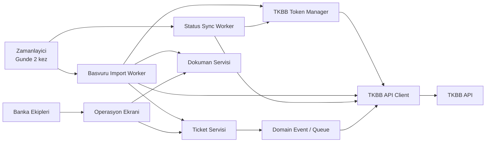
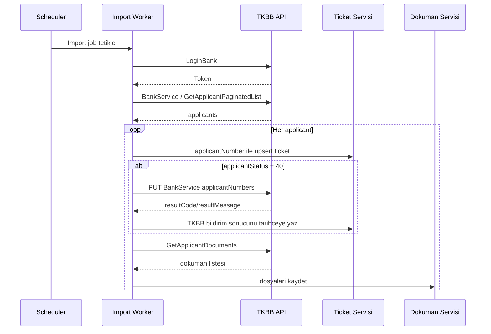
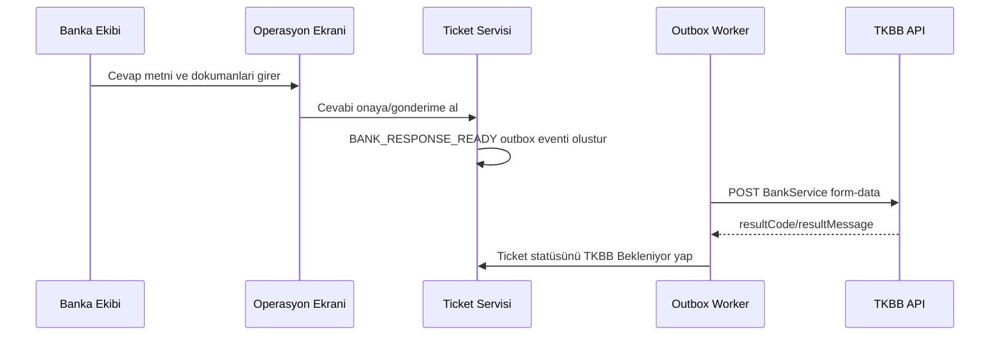
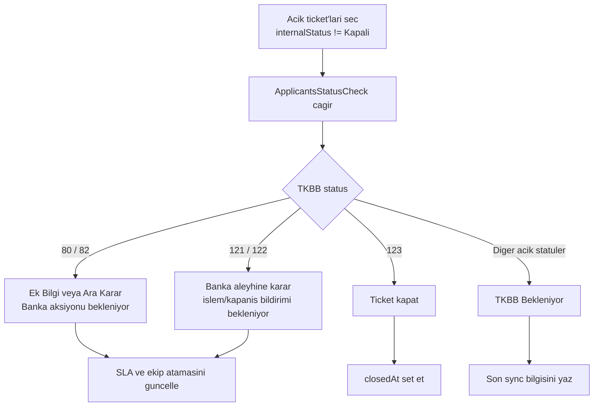

# TKBB Hakem Heyeti Entegrasyonu - Analiz ve Mimari Tasarim

Bu dokuman, TKBB Hakem Heyeti Basvuru Sistemi Rest Web Servis Kullanim Kilavuzu V1.0.7 baz alinarak banka icinde ticket olusturma, status takibi ve TKBB'ye geri bildirim mimarisini tanimlar.

## 1. Amac ve Kapsam

Amaç:

- TKBB tarafindan bankaya iletilen tum sikayet/basvurular icin banka icinde ticket olusturmak.
- Ticket icinde TKBB API'den donen basvuru, dokuman, beklenen belge ve son cevap tarihi bilgilerini saklamak.
- Gunde iki kez calisan planli gorev ile yeni veya guncellenmis TKBB basvurularini almak.
- Banka ekipleri ticket uzerinden islem yaptikca TKBB dokumanindaki uygun API'leri cagirmak.
- Basvuru TKBB'de `Kapanan Basvuru` durumuna gelene kadar, banka disina gonderilen kayitlari banka icinde `TKBB Bekleniyor` statüsünde takip etmek.

Kapsam disi:

- TKBB test/prod ortam credential yonetiminin operasyonel detaylari.
- Banka ic sistemlerindeki nihai organizasyon/ekip matrisi.
- Gercek UI implementasyonu; bu dokumanla birlikte temel HTML ekran tasarimi verilmistir.

## 2. Kaynak TKBB Servisleri

| Islev | Metot | Endpoint | Kullanım |
| --- | --- | --- | --- |
| Token alma | POST | `/BankApi/LoginBank` | Tum servis cagri oncesi Bearer token almak/yenilemek |
| Basvuru sorgulama | GET | `/BankApi/BankService` | Bankaya ait isleme alinacak veya ek bilgi bekleyen basvurular |
| Sayfali basvuru sorgulama | POST | `/BankApi/BankService/GetApplicantPaginatedList` | Belirli adet basvuru almak |
| Basvuru isleme alindi | PUT | `/BankApi/BankService` | Ilk defa alinan `40` durumundaki basvurulari bankanin isleme aldigini bildirmek |
| Basvuru bilgi guncelleme | POST form-data | `/BankApi/BankService` | Banka cevabi, ek bilgi ve dokuman gondermek |
| Basvuru durum sorgulama | POST | `/BankApi/BankService/ApplicantsStatusCheck` | Bankanin isleme aldigi basvurularin guncel TKBB durumunu almak |
| Basvuru dokumanlari | POST | `/BankApi/BankService/GetApplicantDocuments` | Basvuruya ait dokuman listesini almak |
| Buyuk dosya sorgulama | POST | `/BankApi/BankService/GetApplicantDocumentFile` | 10 MB uzeri veya base64 donmeyen dosyalari indirmek |
| Dokuman kategorileri | GET | `/BankApi/BankService/GetDocumentsTypesList` | Beklenen dokuman tiplerini ve kategorilerini almak |
| Banka aleyhine karar kapanis bildirimi | POST | `/BankApi/BankService/ApplicantClosingNotice` | `121` durumundaki banka aleyhine karar icin bankanin islem yaptigini bildirmek |

## 3. Hedef Mimari

### 3.1 Bilesenler

| Bilesen | Sorumluluk |
| --- | --- |
| TKBB Scheduler | Gunde iki kez import ve status kontrol job'larini tetikler. Cron saatleri konfigürasyondan yonetilir. |
| Token Manager | Token'i alir, gecerlilik suresini saklar, suresi dolmadan yeniler. 401 alindiginda tek sefer yenileme dener. |
| TKBB API Client | TKBB endpoint'lerini typed client olarak kapsuller; retry, timeout, correlation id ve audit log ekler. |
| Basvuru Import Worker | TKBB'den basvuru listesini alir, idempotent ticket yaratir/gunceller, dokumanlari indirir. |
| Ticket Servisi | Banka ici ticket lifecycle, atama, SLA, yorum, statü ve tarihceyi yonetir. |
| Dokuman Servisi | TKBB'den gelen ve bankadan TKBB'ye giden dosyalari saklar; dosya hash'i ile tekrar indirmeyi engeller. |
| Status Sync Worker | Acik ticket'lar icin TKBB `ApplicantsStatusCheck` servisini cagirir ve lokal statuleri senkronize eder. |
| Outbound Notification Worker | Banka ekibinin yaptigi statü/dokuman/cevap guncellemelerini TKBB API'lerine iletir. |
| Operasyon Ekrani | Liste, detay, dokuman, durum tarihcesi ve TKBB'ye gonderilecek cevap aksiyonlarini sunar. |

## 4. Temel Veri Modeli

### 4.1 Ticket

| Alan | Aciklama |
| --- | --- |
| `id` | Banka ici ticket id |
| `applicantNumber` | TKBB basvuru numarasi; unique olmalidir |
| `applicantNo` | TKBB basvuru no, ornek `2019/287` |
| `tkbbStatusCode` | TKBB applicant status kodu |
| `internalStatus` | Banka ici statü |
| `customerIdentity` | TCKN maskelenmis sekilde tutulur/gosterilir |
| `customerName` | Basvuru sahibi ad soyad |
| `topicId`, `topicName` | Basvuru konusu |
| `request` | Basvuru talep aciklamasi |
| `message` | TKBB'den gelen ek mesaj veya banka cevabi |
| `bankResponseEndDate` | Bankanin son cevap verme tarihi |
| `decisionTopic` | Karar tipi; banka lehine/aleyhine |
| `assignedTeam`, `assignedUser` | Banka ici sorumlu ekip/kisi |
| `lastTkbbSyncAt` | Son TKBB sorgu tarihi |
| `createdAt`, `updatedAt`, `closedAt` | Ticket tarihleri |

### 4.2 Ticket Document

| Alan | Aciklama |
| --- | --- |
| `id` | Banka ici dokuman id |
| `ticketId` | Ilgili ticket |
| `tkbbDocumentId` | TKBB belge id |
| `name`, `mimeType`, `extension` | Dosya meta verileri |
| `documentTopicId`, `documentTopicName` | Belge tipi |
| `source` | `TKBB`, `BANKA` |
| `storageKey` | Dosya saklama yolu |
| `sha256` | Tekrar indirme/yukleme kontrolu |

### 4.3 Outbox Event

| Event | Ne zaman olusur? | TKBB API |
| --- | --- | --- |
| `TKBB_APPLICATION_RECEIVED` | `40` durumundaki yeni basvuru icin ticket yaratildiginda | `PUT /BankApi/BankService` |
| `BANK_RESPONSE_READY` | Banka ekibi ilk cevabi veya ek bilgi cevabini hazirlayip gonderdiginde | `POST /BankApi/BankService` form-data |
| `BANK_CLOSING_NOTICE_READY` | `121` banka aleyhine karar icin bankada islem tamamlandiginda | `POST /ApplicantClosingNotice` |

Outbox kullanimi, kullanici isleminden sonra TKBB cagrisi basarisiz olsa bile olay kaybinin onlenmesini ve tekrar denenebilmesini saglar.

## 5. Statü Modeli

### 5.1 TKBB Statü Kodlari

| Kod | TKBB Aciklama | Banka Ici Karsilik |
| --- | --- | --- |
| 40 | Basvuru Banka Gonderim Listesinde | `Yeni` |
| 50 | Basvuru Bankaya Gonderildi | `Yeni / TKBB'den Geldi` |
| 60 | Basvuru Banka Tarafindan Isleme Alindi | `Banka Incelemede` |
| 70 | Basvuru Incelemede | `TKBB Bekleniyor` veya ek cevap hazirlanabilir |
| 80 | Basvuru Banka Ek Bilgi Gonderim Listesinde | `Ek Bilgi Bekleniyor` |
| 82 | Hakem Heyeti Tarafindan Ara Karar Verilen Basvuru | `Ara Karar / Banka Aksiyonu` |
| 85 | Ek Bilgiye Istinaden Banka Tarafindan Isleme Alindi | `Banka Incelemede` |
| 90 | Basvuru Banka Ek Bilgi Gonderdi | `TKBB Bekleniyor` |
| 100 | Banka Islemine Gore Onay Karari Verildi | `TKBB Bekleniyor` |
| 105 | Hakem Heyeti Gundemine Alinacaklar Listesinde | `TKBB Bekleniyor` |
| 110 | Hakem Heyeti Gundemine Alindi | `TKBB Bekleniyor` |
| 118 | Heyet Uyeleri Karara Cevap Verdi, Karar Yayinlanmayi Bekliyor | `TKBB Bekleniyor` |
| 120 | Hakem Heyeti Karari Verildi | `TKBB Bekleniyor`; status check sonrasi 121 veya 123'e donebilir |
| 121 | Hakem Heyeti Karari Bankaya Iletildi | `Banka Aleyhine Karar - Islem Bekleniyor` |
| 122 | Banka Aleyhine Kararlar icin TKBB'ye Islem Bildirimi Geciken Basvuru | `Gecikmis Banka Aksiyonu` |
| 123 | Kapanan Basvuru | `Kapali` |

### 5.2 Banka Ici Statü Kurallari

1. TKBB'den gelen her basvuru `applicantNumber` ile tekil kabul edilir.
2. Yeni basvuru `40` ise ticket yaratilir ve `Basvuru Isleme Alindi` API'si cagrilir.
3. Banka ekibi ticket'i uzerine aldiginda lokal durum `Banka Incelemede` olur.
4. Banka cevabi veya ek dokuman TKBB'ye gonderildikten sonra lokal durum `TKBB Bekleniyor` olur.
5. Kural: Kayıt `Kapanan Basvuru (123)` statüsüne dönene kadar, kayıt bankadan çıktıktan sonra banka içinde `TKBB Bekleniyor` statüsünde kalır.
6. TKBB `80`, `82`, `121` veya `122` gibi bankadan aksiyon bekleyen durumlara donerse lokal statü tekrar ilgili banka aksiyon statüsüne cekilir.
7. TKBB `123` dondugunde ticket `Kapali` yapilir ve `closedAt` set edilir.

## 6. Akislar

### 6.1 Gunde Iki Kez Basvuru Import Akisi

Notlar:

- Dokumanda sayfali endpoint sadece `pageSize` aliyor; `pageNumber` belirtilmedigi icin ilk fazda ya GET liste servisi ya da TKBB'nin destekledigi maksimum `pageSize` ile tek sorgu onerilir. TKBB ekibi gercek paging parametresini saglarsa client buna gore genisletilmelidir.
- Job idempotent olmalidir. Ayni basvuru ikinci kez gelirse yeni ticket acilmaz, mevcut ticket ham veri ve statüyle guncellenir.
- Import job calismalari `jobRunId`, baslangic/bitis, basari/hata sayilari ve correlation id ile loglanmalidir.

### 6.2 Ticket Uzerinden Banka Cevabi Gonderme

Bu akis `70` veya `90` durumunda ek cevap gonderimi icin; `80` ve `82` gibi TKBB'nin ek bilgi/ara karar bekledigi durumlarda da banka cevabi hazirlanarak ayni endpoint kullanilir.

### 6.3 Banka Aleyhine Karar Kapanis Bildirimi

1. Status sync veya import sonucunda TKBB statüsü `121` ise ticket `Banka Aleyhine Karar - Islem Bekleniyor` olur.
2. Banka ekibi ic aksiyonu tamamlar ve kapanis mesajini girer.
3. Sistem `ApplicantClosingNotice` servisini cagirir.
4. Basarili sonuc sonrasi lokal statü `TKBB Bekleniyor` olur.
5. Sonraki status sync `123` donene kadar ticket acik kalir.

### 6.4 Status Sync Akisi

## 7. Planli Gorev Tasarimi

| Job | Frekans | Sorumluluk |
| --- | --- | --- |
| `tkbb-application-import` | Gunde 2 kez | TKBB'den basvuru listesi almak, ticket/dokuman upsert etmek, `40` durumlari isleme alindi olarak bildirmek |
| `tkbb-status-sync` | Gunde 2 kez importtan sonra veya ayrica | Acik ticket'larin TKBB durumunu sorgulamak |
| `tkbb-outbox-dispatch` | Kisa periyotlu veya event-driven | Banka kullanici aksiyonlari sonucunda TKBB'ye gidecek bildirimleri gondermek |
| `tkbb-token-refresh` | Gerektiginde | Token suresi dolmadan yenilemek; ayri job zorunlu degildir |

Cron saatleri ornek olarak `09:00` ve `16:00` seklinde konfigure edilebilir; asil saatler operasyonel SLA'ya gore parametrik tutulmalidir.

## 8. Hata, Retry ve Idempotency

- `applicantNumber` icin unique index zorunludur.
- TKBB cagrilari icin timeout, maksimum retry ve exponential backoff uygulanmalidir.
- HTTP `401` icin token yenilenip istek bir kez tekrar denenmelidir.
- HTTP `400` ve servis `resultCode=102/104` gibi is kurali hatalari ticket tarihcesine yazilmali, otomatik tekrar sinirlandirilmalidir.
- TKBB'ye giden tum istek/cevaplar audit log olarak saklanmalidir; TCKN ve hassas veri loglarda maskelenmelidir.
- Dosya indirme/yukleme islemlerinde `sha256` ve dosya boyutu saklanarak tekrarli islem engellenmelidir.
- Outbox event'leri `pending`, `processing`, `sent`, `failed`, `dead-letter` statüleriyle takip edilmelidir.

## 9. Guvenlik ve Uyumluluk

- TKBB userName/password secret manager uzerinden okunmalidir.
- Token veritabani yerine cache/secret-safe alanda tutulmali; loglanmamalidir.
- TCKN, telefon, adres ve e-posta gibi kisisel veriler UI'da rol bazli maskelenmelidir.
- Dosya erisimleri yetki kontrollu ve denetlenebilir olmalidir.
- Tum TKBB endpoint cagrilari icin request/response audit kaydi tutulmali ancak dosya icerikleri audit log'a yazilmamalidir.

## 10. Operasyon Ekrani Gereksinimleri

Liste:

- Basvuru No, TKBB No, musteri, konu, TKBB statüsü, banka ici statü, son cevap tarihi, sorumlu ekip, son sync tarihi.
- Filtreler: banka ici statü, TKBB statü kodu, son cevap tarihi, konu, ekip, gecikenler.
- Aksiyonlar: detaya git, ekibe ata, TKBB durumunu yenile.

Detay:

- Basvuru sahibi bilgileri ve maskeleme.
- Basvuru talep aciklamasi ve TKBB mesajlari.
- Bankadan beklenen dokuman tipleri.
- TKBB'den gelen dosyalar ve banka tarafindan yuklenen dosyalar.
- Cevap metni, dokuman ekleme ve TKBB'ye gonderme.
- Statü tarihcesi ve API cagri sonuclari.

## 11. Kabul Kriterleri

- Gunde iki kez calisan import job TKBB'den gelen tum uygun basvurular icin ticket olusturur veya mevcut ticket'i gunceller.
- `40` durumundaki basvurular icin `Banka Basvuru Isleme Alindi` servisi cagrilir.
- Ticket icerisinde TKBB API'den donen ana basvuru alanlari, dokuman listesi ve son cevap tarihi bulunur.
- Banka ekibi cevap/dokuman gonderdiginde `Banka Basvuru Bilgi Guncelleme` servisi cagrilir ve lokal statü `TKBB Bekleniyor` olur.
- `121` durumundaki banka aleyhine kararlarda banka islem tamamlayinca `ApplicantClosingNotice` servisi cagrilir.
- TKBB `123` donene kadar banka disina cikmis kayitlar `TKBB Bekleniyor` olarak kalir.
- TKBB `123` dondugunde ticket kapatilir.
- Tum API cagrilari, sonuc kodlari ve hata mesajlari ticket tarihcesinde izlenebilir.

